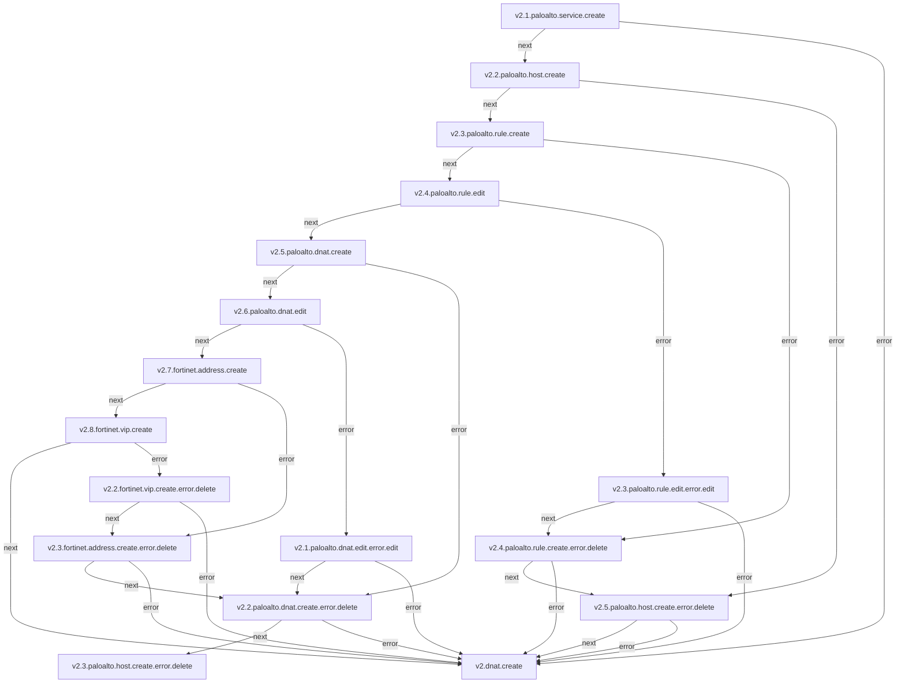
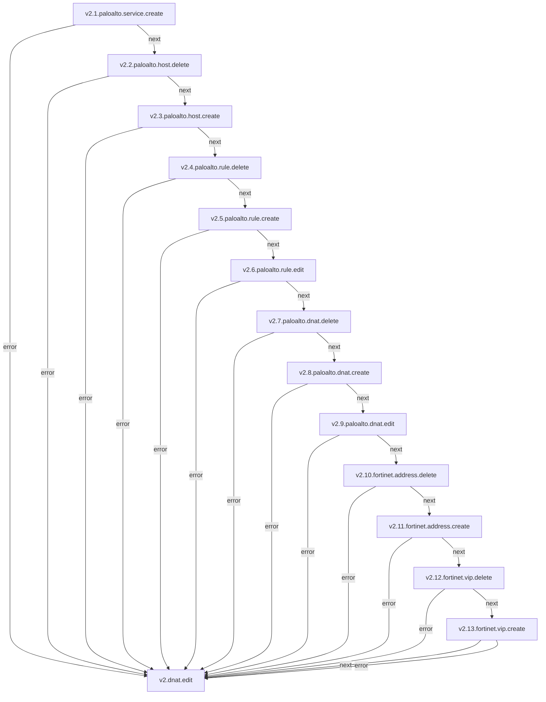
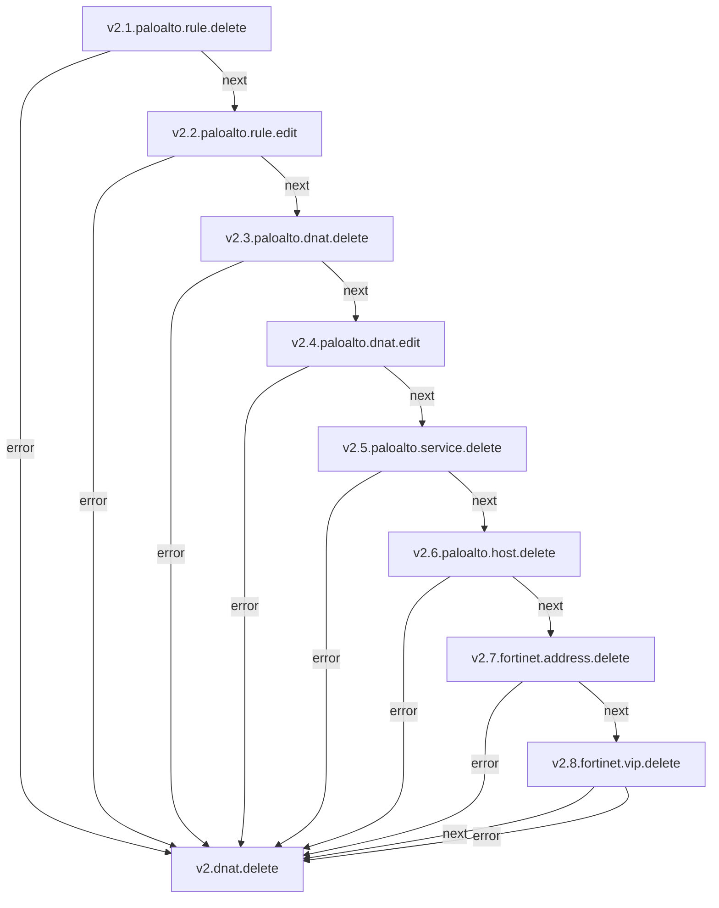

## DNAT

**Objetivo:** A regra DNAT (Destination Network Address Translation) é utilizada para publicar uma aplicação que esteja em sua máquina virtual IaaS para a internet. É um acesso de entrada onde a origem é internet ( sendo uma origem restrita ou não ) e o destino é o IP Público e Porta externa IaaS, onde a regra DNAT faz a tradução para o IP Privado de sua máquina virtual, na Porta interna e Protocolo de sua aplicação.

### Fluxo - Criação de DNAT

## Serviços envolvidos

- [v2.1.paloalto.service.create](paloalto-service.md#fluxo---service-create)
- [v2.2.paloalto.host.create](paloalto-host.md#fluxo---host-create)
- [v2.3.paloalto.rule.create](paloalto-rule.md#fluxo---rule-create)
- [v2.4.paloalto.rule.edit](paloalto-rule.md#fluxo---rule-edit)
- [v2.5.paloalto.dnat.create](paloalto-nat.md#fluxo---dnat-create)
- [v2.6.paloalto.dnat.edit](paloalto-nat.md#fluxo---dnat-edit)
---

### Fluxo - Edição de DNAT

### Fluxo - Remoção de DNAT

