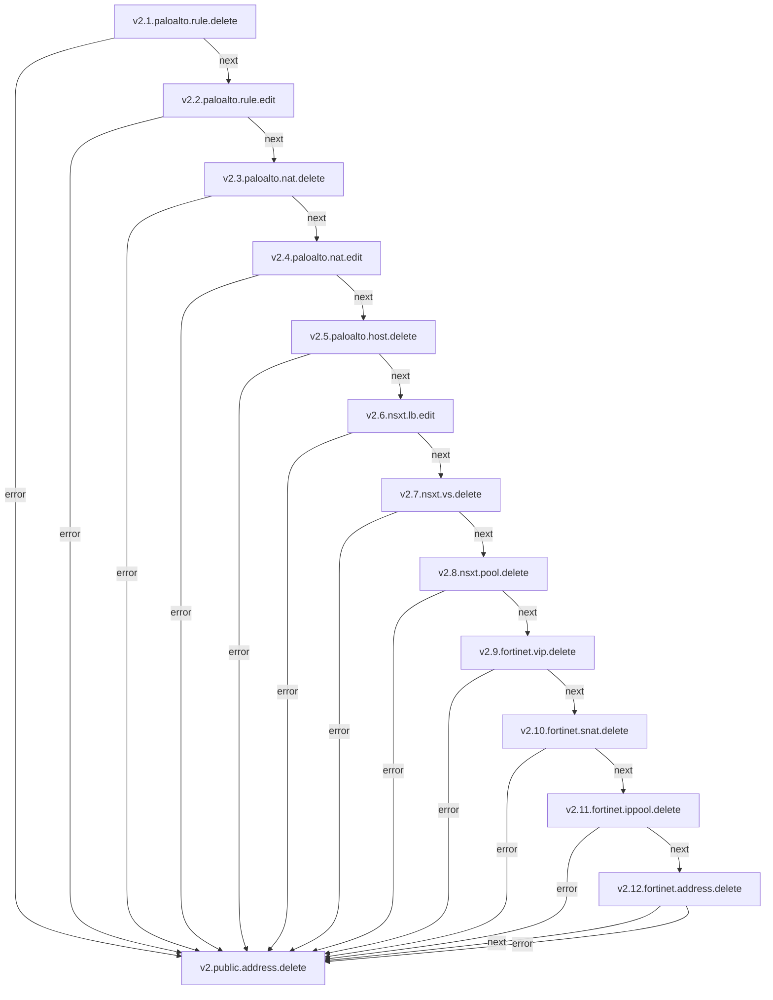

# PUBLIC_ADDRESS

**Objetivo:** Criar e gerenciar os endereço de IP Público para o ambiente da organização .

## Fluxo - Public-Address Create

**Obs:** A criação de Public-Address não utiliza serviços como é feito no delete, pois é criado diretamente no api-nemesis que é o microservico principal do gateway, e segue o fluxo normal de criação de host

### Serviços envolvidos na criação

- [fluxo de host](paloalto-host.md#fluxo---host-create)

### Serviços envolvidos no delete

- [v2.1.paloalto.rule.delete](paloalto-rule.md#fluxo---rule-delete)
- [v2.2.paloalto.rule.edit](paloalto-rule.md#fluxo---rule-edit)
- [v2.3.paloalto.nat.delete](paloalto-nat.md#fluxo---nat-delete)
- [v2.4.paloalto.nat.edit](paloalto-nat.md#fluxo---nat-edit)
- [v2.5.paloalto.host.delete](paloalto-host.md#fluxo---host-delete)

## Fluxo - Public-Address Delete

