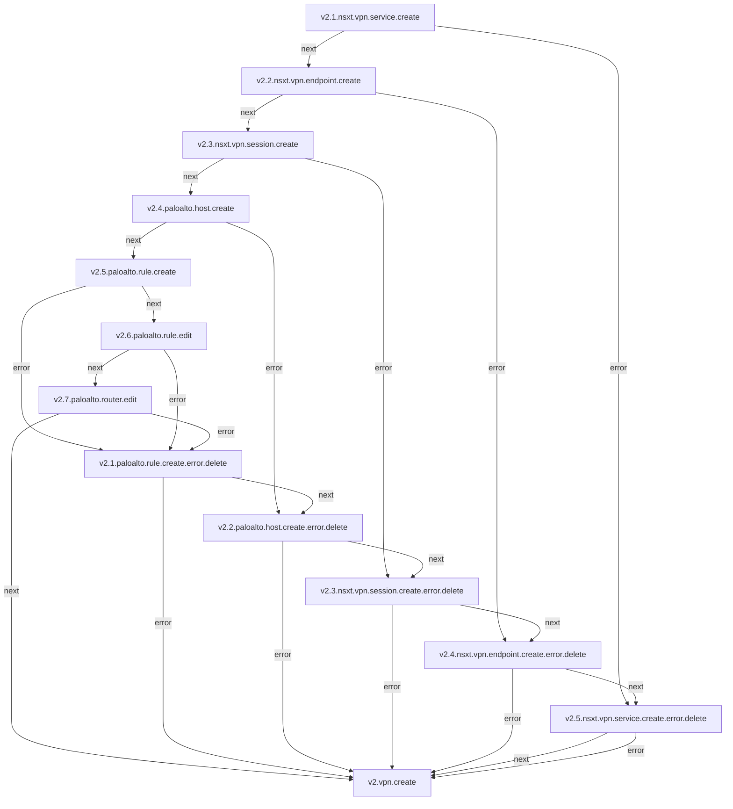
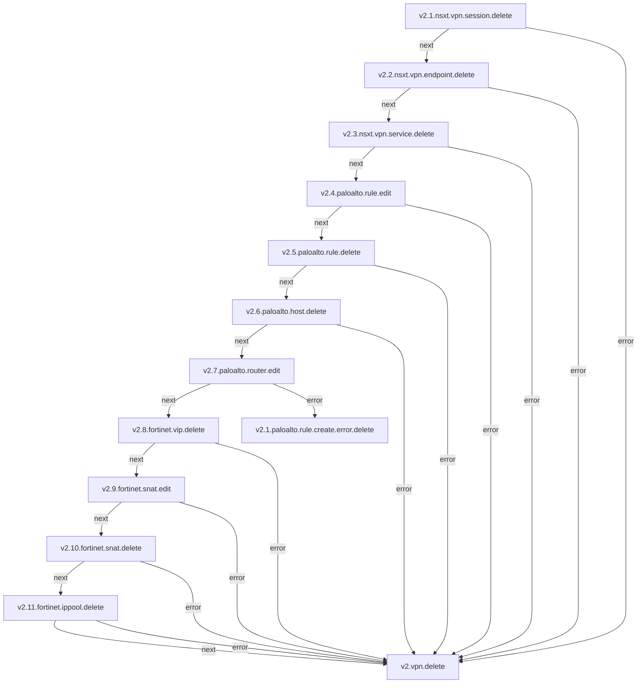

# SDN-VPN

**Objetivo:** Criar e gerenciar uma rede privada virtual (VPN) utilizando Software-Defined Networking (SDN) para melhorar a segurança, flexibilidade e gerenciamento da rede.

## Fluxo - SDN-VPN Create

### Serviços envolvidos

- [v2.4.paloalto.host.create](paloalto-host.md#fluxo---host-create)
- [v2.5.paloalto.rule.create](paloalto-rule.md#fluxo---rule-create)
- [v2.6.paloalto.rule.edit](paloalto-rule.md#fluxo---rule-edit)
- [v2.7.paloalto.router.edit](paloalto-router.md#fluxo---router-edit)

## Fluxo - SDN-VPN Delete

