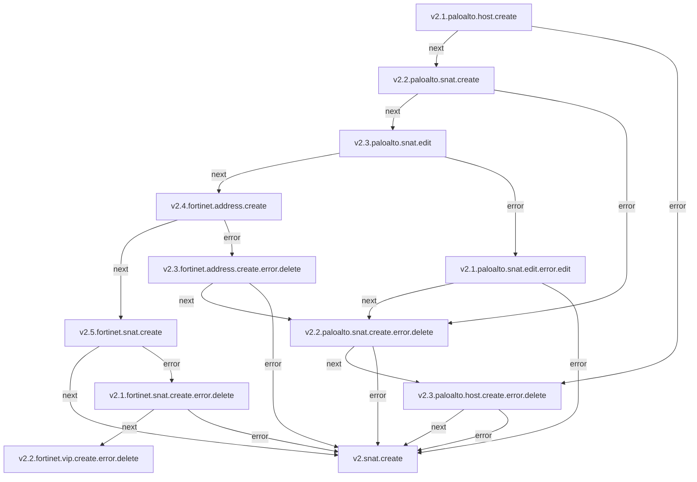
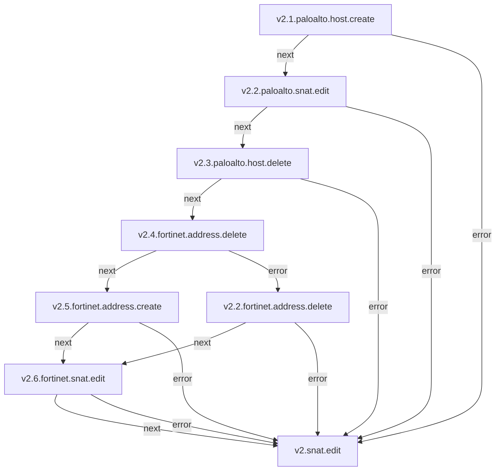
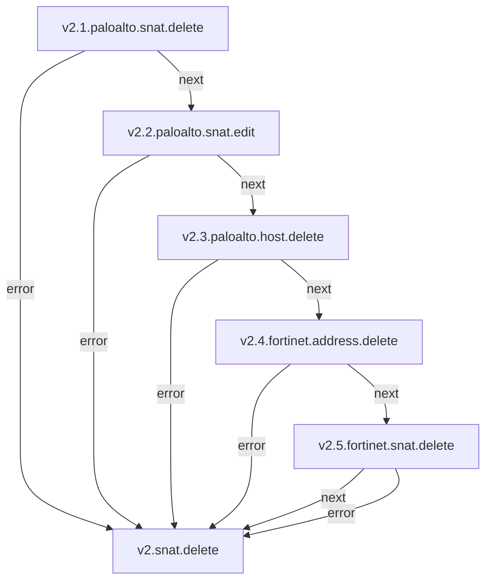

## SNAT

**Objetivo:** A regra SNAT (Source Network Address Translation) é utilizada no sentido de Saída, ou seja, uma máquina virtual IaaS acessando a Internet. A máquina virtual IaaS não possui um IP válido para a Internet, sendo necessário uma tradução do IP Privado da máquina virtual para um IP Público válido na Internet.

### Fluxo - Criação de SAT

## Serviços envolvidos

- [v2.1.paloalto.host.create](paloalto-host.md#fluxo---host-create)
- [v2.2.paloalto.snat.create](paloalto-nat.md#fluxo---snat-create)
- [v2.3.paloalto.snat.edit](paloalto-nat.md#fluxo---snat-edit)

---

### Fluxo - Edição de NAT

### Fluxo - Remoção de SNAT

