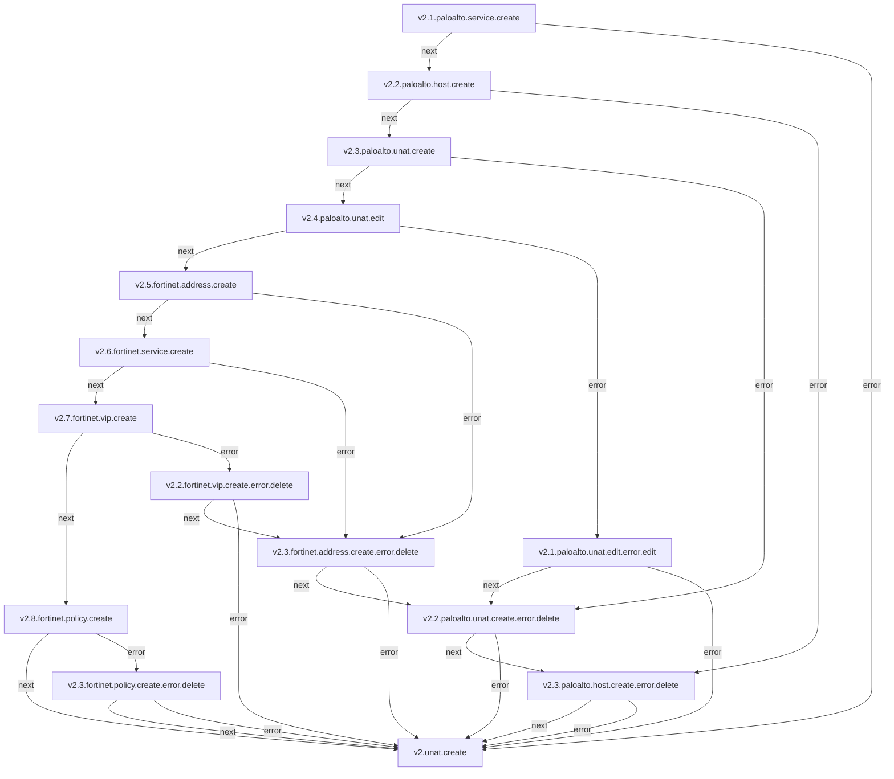
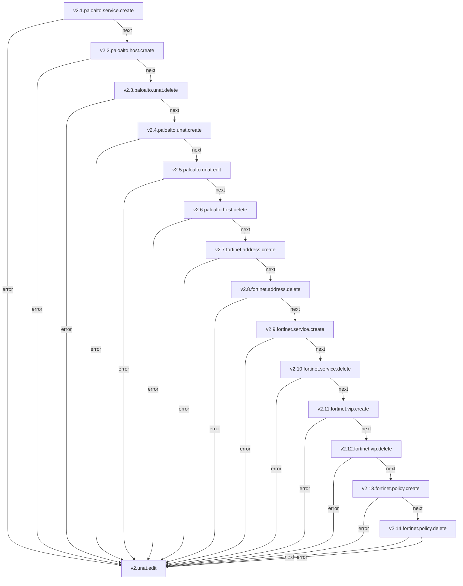
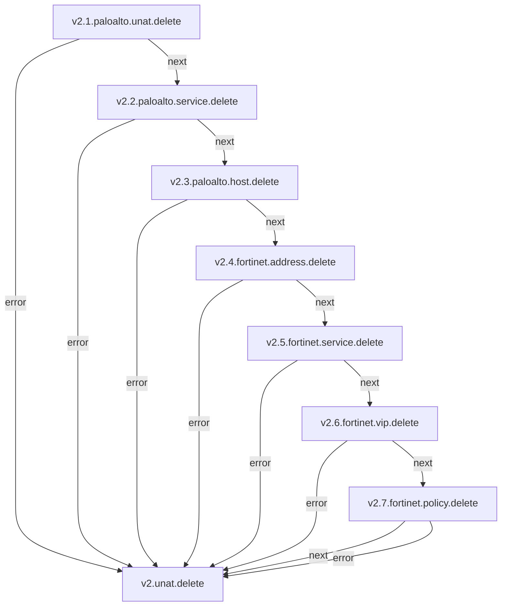

## UNAT

**Objetivo:** O UNAT, também conhecido como U-Turn NAT, é um tipo especial de NAT utilizado quando usuários internos precisam acessar um servidor interno usando o endereço de IP público do servidor. Nestes casos, a origem e destino compartilham do mesmo firewall e ambiente de rede.

### Fluxo - Criação de UNAT

## Serviços envolvidos

- [v2.1.paloalto.service.create](paloalto-service.md#fluxo---service-create)
- [v2.2.paloalto.host.create](paloalto-host.md#fluxo---host-create)
- [v2.3.paloalto.unat.create](paloalto-nat.md#fluxo---unat-create)
- [v2.4.paloalto.unat.edit](paloalto-nat.md#fluxo---unat-edit)
---

### Fluxo - Edição de UNAT

### Fluxo - Remoção de UNAT

