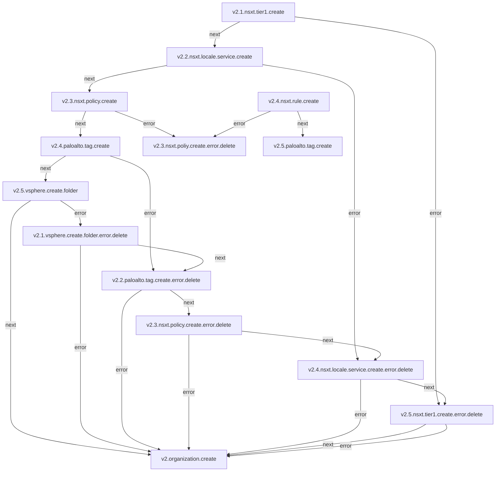
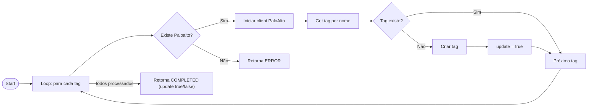

## TAG

**Objetivo:** Criação e remoção de Tag no Paloalto. Esse recurso está dentro do fluxo de criação de Organization. v2.4.paloalto.tag.create

### Fluxo



## Micro Serviço paloalto-tag - create

### Fluxo



### Payload no Micro Serviço

```json
{
  "PaloaltoTag": [
    {
      "ID": 6781,
      "CreatedAt": "2025-12-16T14:55:59Z",
      "UpdatedAt": "2025-12-16T14:55:59Z",
      "DeletedAt": null,
      "OrganizationID": 3949,
      "Name": "T13726_C1B7HY_iaas",
      "Identifier": "fisico"
    }
  ]
}
```

### End-Point API PaloAlto

> /config/devices/entry[@name='localhost.localdomain']/vsys/entry[@name='vsys2']/tag/entry[@name='T13726_C1B7HY_iaas']

### Payload API PaloAlto

```json
{
  "Name": "TFDFA0_CP2RY7_iaas",
  "Path": "tag",
  "Color": "color9",
  "Comments": "TFDFA0_CP2RY7_iaas"
}

```


 