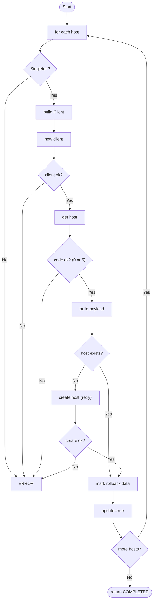

# PALOALTO HOST

## Micro Serviço paloalto-host

### Fluxo - Host Create



## Payload no Micro Serviço - paloalto-host
  
```json
{
  "Name": "TFDNBM_CV5RGT_ate_HST-189.126.152.92",
  "Vsys": "vsys1",
  "Address": "189.126.152.92/32",
  "Identifier": "fisico"
}
```

### End-Point API PaloAlto - Address Object

> /restapi/v10.2/Objects/Addresses

### Payload API PaloAlto - Address Object

```json
{
  "entry": {
    "@name": "TFDNBM_CV5RGT_ate_HST-189.126.152.92",
    "ip-netmask": "189.126.152.92/32"
  }
}
```