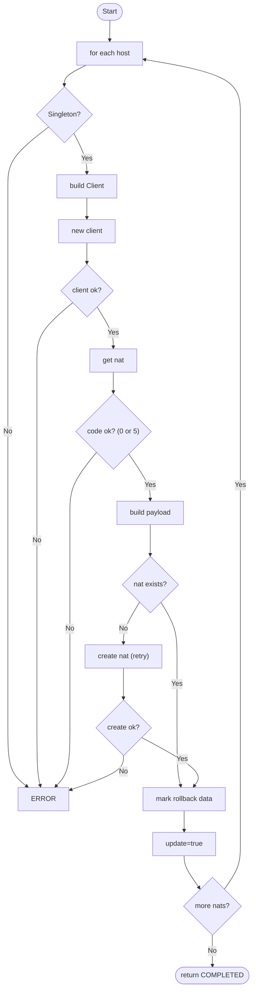
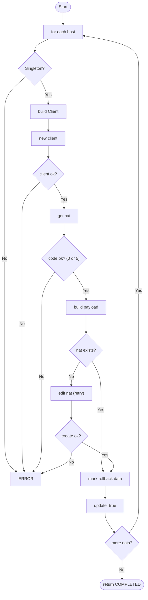

# PALOALTO NAT

## Micro Serviço paloalto-nat

### Fluxo - Nat Create




### End-Point API PaloAlto - Nat Object

> /config/devices/entry[@name='localhost.localdomain']/vsys/entry[@name='vsys2']/nat/entry[@name='TEZAX9_CSV7UN_iaas']

### Payload API PaloAlto - Nat Object

```json
{
  "Name": "TEZAX9_CSV7UN_iaas_SNAT-1",
  "Path": "nat",
  "Interface": "any",
  "ServiceNat": "any",
  "SourceTranslation": {
    "AddressDynamicAndPort": "TEZAX9_CSV7UN_iaas_HST-189.126.138.52"
  },
  "To": {
    "Member": "Externo"
  },
  "From": {
    "Member": [
      "Floating-NSX"
    ]
  },
  "Source": {
    "Member": [
      "HST-10.104.7.213"
    ]
  },
  "Destination": {
    "Member": [
      "any"
    ]
  }
}
```

### Fluxo - Nat Edit




### End-Point API PaloAlto - Nat Object

> /config/devices/entry[@name='localhost.localdomain']/vsys/entry[@name='vsys2']/nat/entry[@name='TEZAX9_CSV7UN_iaas']

### Payload API PaloAlto - Nat Object

```json
{
  "Name": "TEZAX9_CSV7UN_iaas_SNAT-1",
  "Path": "nat",
  "Interface": "any",
  "ServiceNat": "any",
  "SourceTranslation": {
    "AddressDynamicAndPort": "TEZAX9_CSV7UN_iaas_HST-189.126.138.52"
  },
  "To": {
    "Member": "Externo"
  },
  "From": {
    "Member": [
      "Floating-NSX"
    ]
  },
  "Source": {
    "Member": [
      "HST-10.104.7.213"
    ]
  },
  "Destination": {
    "Member": [
      "any"
    ]
  }
}
```