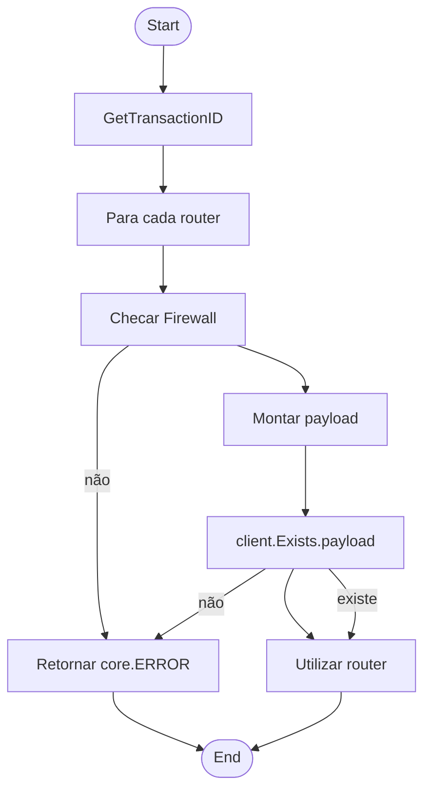

# PALOALTO ROUTER

## Micro Serviço paloalto-router

### Fluxo - Get Router



### End-Point API PaloAlto

> /config/devices/entry[@name='localhost.localdomain']/vsys/entry[@name='vsys2']/router/entry[@name='TEZII4_CKGMN8_iaas']

### Payload API PaloAlto

```json
{
  "Name": "default",
  "Path": "router"
}

```