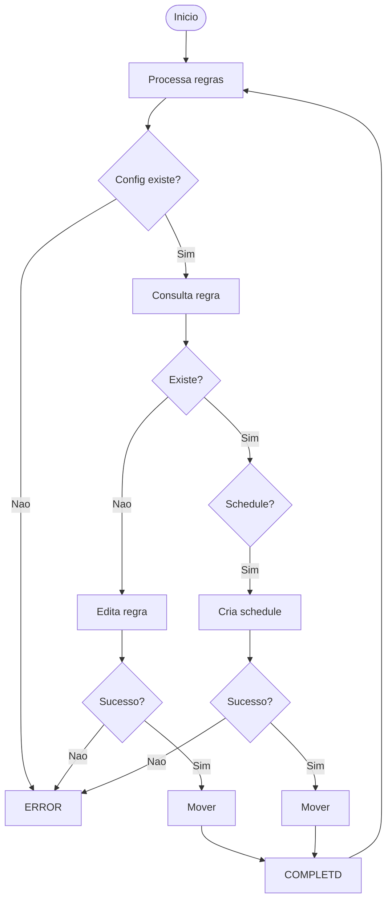
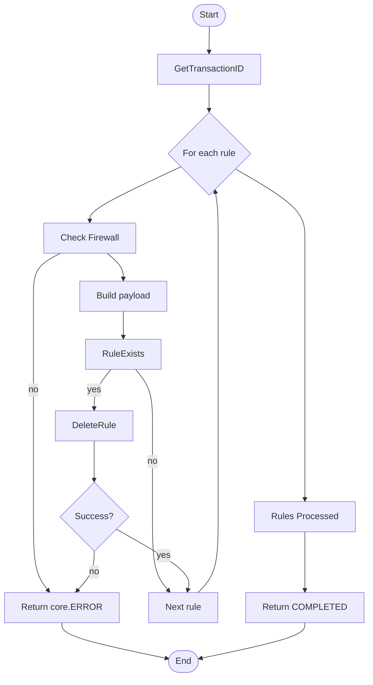

# PALOALTO RULE

## Micro Serviço paloalto-rule para SDN VPN

### Fluxo - Rule Create


### End-Point API PaloAlto - Security Rule

> /config/devices/entry[@name='localhost.localdomain']/vsys/entry[@name='vsys2']/rule/entry[@name='TEZII4_CKGMN8_iaas']


### Payload API PaloAlto - Security Rule - payload IKE IN

```json
{
  "Name": "TEZII4_CKGMN8_iaas_IKE_IN",
  "Path": "rule",
  "Source": {
    "Member": [
      "HST-187.106.0.94",
      "HST-186.209.88.98",
      "HST-4.222.17.247",
      "HST-4.228.106.21",
      "HST-13.246.172.201",
      "HST-20.226.119.127",
      "HST-24.152.43.30",
      "HST-45.161.237.188",
      "HST-131.161.70.50",
      "HST-132.255.167.42",
      "HST-138.94.112.118",
      "HST-168.232.46.44",
      "HST-177.73.75.170",
      "HST-177.128.224.111",
      "HST-177.129.185.146",
      "HST-177.200.94.118",
      "HST-181.94.236.204",
      "HST-186.208.120.218",
      "HST-186.236.68.90",
      "HST-187.29.175.82",
      "HST-187.60.37.73",
      "HST-189.2.54.130",
      "HST-189.2.155.210",
      "HST-189.3.125.114",
      "HST-189.8.32.178",
      "HST-189.8.37.106",
      "HST-189.8.37.194",
      "HST-189.16.187.194",
      "HST-189.23.3.146",
      "HST-189.112.37.41",
      "HST-193.186.4.202",
      "HST-200.142.189.34",
      "HST-200.142.189.64",
      "HST-200.167.26.34",
      "HST-200.168.199.82",
      "HST-200.178.166.146",
      "HST-200.179.29.146",
      "HST-200.179.80.242",
      "HST-200.183.49.50",
      "HST-200.211.107.2",
      "HST-200.214.21.98",
      "HST-200.228.209.70",
      "HST-200.246.253.194",
      "HST-201.30.220.162",
      "HST-201.57.31.66",
      "HST-201.65.143.130",
      "HST-201.72.133.210",
      "ZA",
      "HST-200.187.95.194",
      "HST-201.31.104.210"
    ]
  }
}
```

### Payload API PaloAlto - Security Rule - payload IKE OUT

```json
{
  "Name": "TEZII4_CKGMN8_iaas_IKE_OUT",
  "Path": "rule",
  "Destination": {
    "Member": [
      "HST-187.106.0.94",
      "HST-186.209.88.98",
      "HST-4.222.17.247",
      "HST-4.228.106.21",
      "HST-13.246.172.201",
      "HST-20.226.119.127",
      "HST-24.152.43.30",
      "HST-45.161.237.188",
      "HST-131.161.70.50",
      "HST-132.255.167.42",
      "HST-138.94.112.118",
      "HST-168.232.46.44",
      "HST-177.73.75.170",
      "HST-177.128.224.111",
      "HST-177.129.185.146",
      "HST-177.200.94.118",
      "HST-181.94.236.204",
      "HST-186.208.120.218",
      "HST-186.236.68.90",
      "HST-187.29.175.82",
      "HST-187.60.37.73",
      "HST-189.2.54.130",
      "HST-189.2.155.210",
      "HST-189.3.125.114",
      "HST-189.8.32.178",
      "HST-189.8.37.106",
      "HST-189.8.37.194",
      "HST-189.16.187.194",
      "HST-189.23.3.146",
      "HST-189.112.37.41",
      "HST-193.186.4.202",
      "HST-200.142.189.34",
      "HST-200.142.189.64",
      "HST-200.167.26.34",
      "HST-200.168.199.82",
      "HST-200.178.166.146",
      "HST-200.179.29.146",
      "HST-200.179.80.242",
      "HST-200.183.49.50",
      "HST-200.211.107.2",
      "HST-200.214.21.98",
      "HST-200.228.209.70",
      "HST-200.246.253.194",
      "HST-201.30.220.162",
      "HST-201.57.31.66",
      "HST-201.65.143.130",
      "HST-201.72.133.210",
      "ZA",
      "HST-200.187.95.194",
      "HST-201.31.104.210"
    ]
  }
}
```

### Fluxo - Rule Edit




### End-Point API PaloAlto - Security Rule

> /config/devices/entry[@name='localhost.localdomain']/vsys/entry[@name='vsys2']/rule/entry[@name='TEZII4_CKGMN8_iaas']


### Payload API PaloAlto - Security Rule - payload IKE IN

```json
{
  "Name": "TEZII4_CKGMN8_iaas_IKE_IN",
  "Path": "rule",
  "Source": {
    "Member": [
      "HST-187.106.0.94",
      "HST-186.209.88.98",
      "HST-4.222.17.247",
      "HST-4.228.106.21",
      "HST-13.246.172.201",
      "HST-20.226.119.127",
      "HST-24.152.43.30",
      "HST-45.161.237.188",
      "HST-131.161.70.50",
      "HST-132.255.167.42",
      "HST-138.94.112.118",
      "HST-168.232.46.44",
      "HST-177.73.75.170",
      "HST-177.128.224.111",
      "HST-177.129.185.146",
      "HST-177.200.94.118",
      "HST-181.94.236.204",
      "HST-186.208.120.218",
      "HST-186.236.68.90",
      "HST-187.29.175.82",
      "HST-187.60.37.73",
      "HST-189.2.54.130",
      "HST-189.2.155.210",
      "HST-189.3.125.114",
      "HST-189.8.32.178",
      "HST-189.8.37.106",
      "HST-189.8.37.194",
      "HST-189.16.187.194",
      "HST-189.23.3.146",
      "HST-189.112.37.41",
      "HST-193.186.4.202",
      "HST-200.142.189.34",
      "HST-200.142.189.64",
      "HST-200.167.26.34",
      "HST-200.168.199.82",
      "HST-200.178.166.146",
      "HST-200.179.29.146",
      "HST-200.179.80.242",
      "HST-200.183.49.50",
      "HST-200.211.107.2",
      "HST-200.214.21.98",
      "HST-200.228.209.70",
      "HST-200.246.253.194",
      "HST-201.30.220.162",
      "HST-201.57.31.66",
      "HST-201.65.143.130",
      "HST-201.72.133.210",
      "ZA",
      "HST-200.187.95.194",
      "HST-201.31.104.210"
    ]
  }
}
```

### Payload API PaloAlto - Security Rule - payload IKE OUT

```json
{
  "Name": "TEZII4_CKGMN8_iaas_IKE_OUT",
  "Path": "rule",
  "Destination": {
    "Member": [
      "HST-187.106.0.94",
      "HST-186.209.88.98",
      "HST-4.222.17.247",
      "HST-4.228.106.21",
      "HST-13.246.172.201",
      "HST-20.226.119.127",
      "HST-24.152.43.30",
      "HST-45.161.237.188",
      "HST-131.161.70.50",
      "HST-132.255.167.42",
      "HST-138.94.112.118",
      "HST-168.232.46.44",
      "HST-177.73.75.170",
      "HST-177.128.224.111",
      "HST-177.129.185.146",
      "HST-177.200.94.118",
      "HST-181.94.236.204",
      "HST-186.208.120.218",
      "HST-186.236.68.90",
      "HST-187.29.175.82",
      "HST-187.60.37.73",
      "HST-189.2.54.130",
      "HST-189.2.155.210",
      "HST-189.3.125.114",
      "HST-189.8.32.178",
      "HST-189.8.37.106",
      "HST-189.8.37.194",
      "HST-189.16.187.194",
      "HST-189.23.3.146",
      "HST-189.112.37.41",
      "HST-193.186.4.202",
      "HST-200.142.189.34",
      "HST-200.142.189.64",
      "HST-200.167.26.34",
      "HST-200.168.199.82",
      "HST-200.178.166.146",
      "HST-200.179.29.146",
      "HST-200.179.80.242",
      "HST-200.183.49.50",
      "HST-200.211.107.2",
      "HST-200.214.21.98",
      "HST-200.228.209.70",
      "HST-200.246.253.194",
      "HST-201.30.220.162",
      "HST-201.57.31.66",
      "HST-201.65.143.130",
      "HST-201.72.133.210",
      "ZA",
      "HST-200.187.95.194",
      "HST-201.31.104.210"
    ]
  }
}
```

### Fluxo - Rule Delete




### End-Point API PaloAlto

> /config/devices/entry[@name='localhost.localdomain']/vsys/entry[@name='vsys2']/rule/entry[@name='T56593_CJP8BD_iaas']

### Payload API PaloAlto

```json
{
  "Name":"T56593_CJP8BD_iaas-6"
}
```