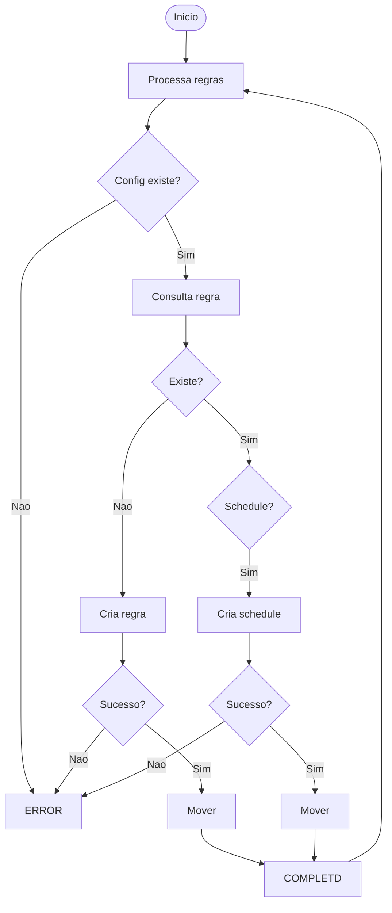

# PALOALTO RULE

## Micro Serviço paloalto-rule

### Fluxo - Rule Create




## Payload no Micro Serviço - paloalto-rule
  
```json
{
	"Name": "TDEVOPS_CDEVOPS_ate-200",
	"To": "External_Clients-Interno",
	"From": "External_Clients-Externo",
	"Source": {
		"Address": "BR"
	},
	"Destination": {
		"Address": "SHARED_HST-181.41.174.74"
	},
	"SourceUser": "any",
	"Category": "any",
	"Application": "any",
	"Tag": "TDEVOPS_CDEVOPS_ate",
	"Action": "allow",
	"Move": "Drop-Regions-vsys2",
	"MoveDirection": "before",
	"Identifier": "fisico",
	"AllPortsRule": [
		{
			"Name": "TCP-2203"
		},
		{
			"Name": "TCP-2204"
		},
		{
			"Name": "TCP-2202"
		}
	],
	"SetProfiles": true,
	"VirusProfile": "default",
	"LogSetting": "FWD_ELK_syslog_vsys2"
}
```

### End-Point API PaloAlto - Security Rule

> /restapi/v10.2/SecurityRules

### Payload API PaloAlto - Security Rule

```json
{
  "@name": "TFEOT4_CKOYPH_ate-1",
  "@location": "vsys",
  "from": {
    "member": [
      "External_Clients-Externo"
    ]
  },
  "to": {
    "member": [
      "External_Clients-Interno"
    ]
  },
  "source": {
    "member": [
      "any"
    ]
  },
  "destination": {
    "member": [
      "SHARED_HST-181.41.163.26"
    ]
  },
  "source-user": {
    "member": [
      "any"
    ]
  },
  "category": {
    "member": [
      "any"
    ]
  },
  "application": {
    "member": [
      "any"
    ]
  },
  "service": {
    "member": [
      "TCP-10801",
      "TCP-10802",
      "TCP-10803",
      "TCP-10866",
      "TCP-10867",
      "TCP-10868",
      "TCP-10869"
    ]
  },
  "action": "allow",
  "tag": {
    "member": [
      "TFEOT4_CKOYPH_ate"
    ]
  },
  "log-setting": "FWD_ELK_syslog_vsys2",
  "profile-setting": {
    "profiles": {
      "virus": {
        "member": [
          "default"
        ]
      },
      "vulnerability": {
        "member": [
          "ips_base"
        ]
      }
    }
  }
}
```

## Exemplo com Membro na Origem

```json
{
  "@name": "TEZDNB_CGNRO8_ate-9",
  "from": {
    "member": [
      "External_Clients-Externo"
    ]
  },
  "to": {
    "member": [
      "External_Clients-Interno"
    ]
  },
  "source": {
    "member": [
      "HST-200.49.58.57",
      "HST-200.49.32.58",
      "HST-200.49.58.169",
      "HST-200.49.59.89",
      "HST-189.8.9.122",
      "HST-189.126.141.144"
    ]
  },
  "destination": {
    "member": [
      "TEZDNB_CGNRO8_ate_HST-181.41.162.45"
    ]
  },
  "source-user": {
    "member": [
      "any"
    ]
  },
  "category": {
    "member": [
      "any"
    ]
  },
  "application": {
    "member": [
      "any"
    ]
  },
  "service": {
    "member": [
      "TCP-37000"
    ]
  },
  "action": "allow",
  "tag": {
    "member": [
      "TEZDNB_CGNRO8_ate"
    ]
  }
}
```

## Exemplo com País na Origem

```json
{
  "@name": "TFCVY2_C6HOGA_ate-6",
  "@location": "vsys",
  "from": {
    "member": [
      "External_Clients-Externo"
    ]
  },
  "to": {
    "member": [
      "External_Clients-Interno"
    ]
  },
  "source": {
    "member": [
      "BR",
      "US",
      "SE",
      "TW",
      "PT"
    ]
  },
  "destination": {
    "member": [
      "TFCVY2_C6HOGA_ate_HST-181.41.161.192"
    ]
  },
  "source-user": {
    "member": [
      "any"
    ]
  },
  "category": {
    "member": [
      "any"
    ]
  },
  "application": {
    "member": [
      "any"
    ]
  },
  "service": {
    "member": [
      "TCP-2323",
      "TCP-4060",
      "TCP-4000",
      "TCP-4070",
      "TCP-6800",
      "TCP-8800",
      "TCP-6900",
      "TCP-7600",
      "TCP-8402",
      "TCP-443",
      "TCP-8403",
      "TCP-4010",
      "TCP-4020",
      "TCP-4030",
      "TCP-4040",
      "TCP-4050",
      "TCP-4080",
      "TCP-6700",
      "TCP-6000",
      "TCP-7800"
    ]
  },
  "action": "allow",
  "tag": {
    "member": [
      "TFCVY2_C6HOGA_ate"
    ]
  },
  "profile-setting": {
    "profiles": {
      "virus": {
        "member": [
          "default"
        ]
      }
    }
  }
}
```

### Fluxo - Rule Delete


## Payload no Micro Serviço

```json
{
  "Name":"TDEVOPS_CDEVOPS_ate-200",
}
```

### End-Point API PaloAlto

> /restapi/v10.2/SecurityRules

### Payload API PaloAlto

```json
{
  "entry": {
    "@name": "TDEVOPS_CDEVOPS_ate-200"
  }
}
```