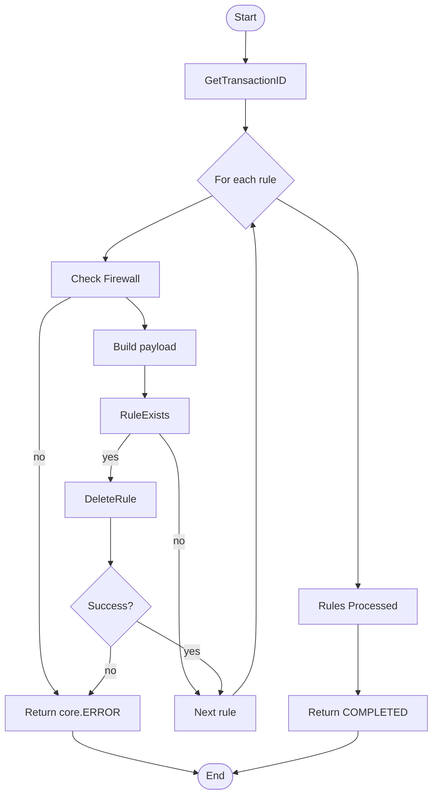

# PALOALTO RULE

## Micro Serviço paloalto-rule

### Fluxo - Rule Create


### End-Point API PaloAlto - Security Rule

> /config/devices/entry[@name='localhost.localdomain']/vsys/entry[@name='vsys2']/rule/entry[@name='T56593_CJP8BD_iaas']

### Payload API PaloAlto - Security Rule

```json
{
  "Name": "T56593_CJP8BD_iaas-6",
  "Path": "rule",
  "ServiceRule": {
    "Member": [
      "TCP-9001",
      "TCP-9000",
      "TCP-443"
    ]
  }
}
```

### Fluxo - Rule Delete




### End-Point API PaloAlto

> /config/devices/entry[@name='localhost.localdomain']/vsys/entry[@name='vsys2']/rule/entry[@name='T56593_CJP8BD_iaas']

### Payload API PaloAlto

```json
{
  "Name":"T56593_CJP8BD_iaas-6"
}
```