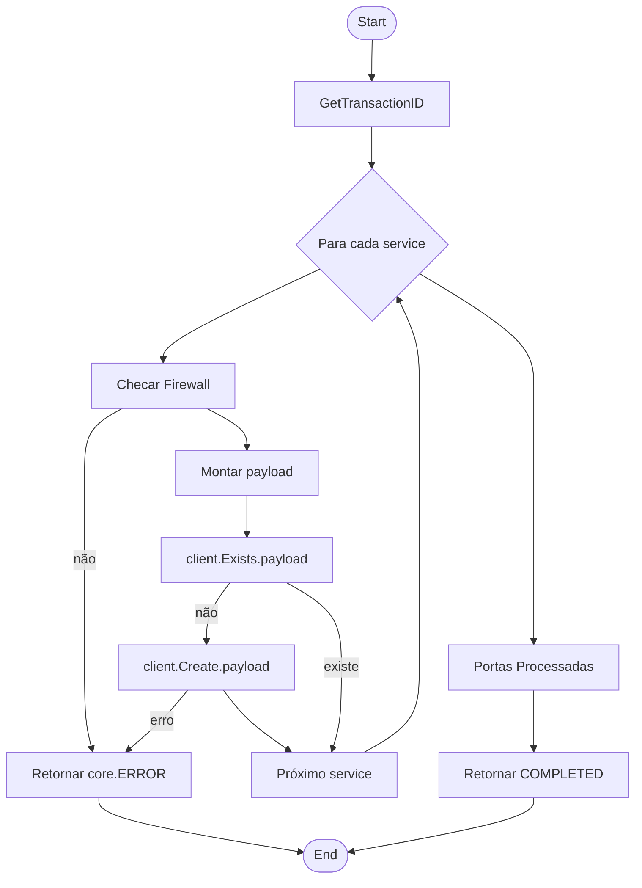
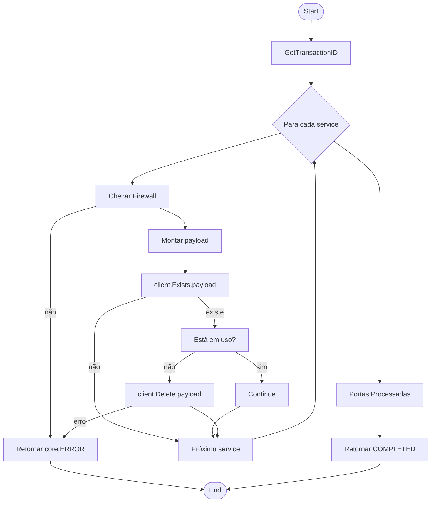

# PALOALTO SERVICE

## Micro Serviço paloalto-service

### Fluxo - Service Create



### End-Point API PaloAlto

> /config/devices/entry[@name='localhost.localdomain']/vsys/entry[@name='vsys2']/service/entry[@name='T56593_CJP8BD_iaas']

### Payload API PaloAlto

```json
{
  "Name":"TCP-63000",
  "Path":"service",
  "Port": {
    "Port":"63000"
  }
}
```

### Fluxo - Service Delete



### End-Point API PaloAlto

> /config/devices/entry[@name='localhost.localdomain']/vsys/entry[@name='vsys2']/service/entry[@name='T56593_CJP8BD_iaas']

### Payload API PaloAlto

```json
{
  "Name":"TCP-63000"
}
```